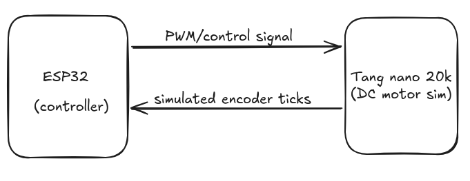

# Hardware-in-the-Loop (HIL) DC Motor Simulator

A dual-core embedded control testbench pairing an ESP32-S3 (acting as the digital controller) with a Tang Nano 20K FPGA (acting as a real-time hardware plant simulator).

This project simulates a physical DC motor entirely within FPGA logic, allowing control engineers to test and tune control algorithms (like PID or State-Space controllers) safely without physical hardware risk.

## System Architecture

## 1. Mathematical Plant Modeling & Discretization

The physical plant represents an armature-controlled DC motor governed by the continuous-time transfer function relating angular velocity Omega(s) to armature voltage V(s):

Omega(s) / V(s) = Kt / [ (Js + b)(Ra + Ls) + Kt Ke ]

Where:

- J = Rotor inertia
- b = Viscous damping coefficient
- Ra = Armature resistance
- L = Armature inductance (often negligible in small motors, leading to a first-order approximation)
- Kt = Torque constant
- Ke = Back-EMF constant

### Discretization via Backward Euler Method

To implement this efficiently in FPGA hardware without floating-point units, the continuous differential equations are discretized using the Backward Euler approximation for the derivative operator:
s ≈ (1 - z^-1) / Ts

This yields a recursive difference equation for angular velocity omega at step k:
omega[k+1] = omega[k] + Ts * ( (Kt / J) * v[k] - (b / J) * omega[k] )

Position is obtained by numerically integrating the velocity using a rectangular Riemann sum:
theta[k+1] = theta[k] + Ts * omega[k]

## 2. Signal Processing & FPGA Implementation Details

### Fixed-Point Arithmetic & Scaling

FPGAs excel at parallel integer math, but lack native floating-point efficiency. To simulate fractional values and damp coefficients cleanly:

- Division operations are replaced by bit-shift operations (e.g., `>> 3` or `>> 8`) to drastically minimize logic cell consumption and timing latency.
- State variables (velocity and position) are stored in wide registers (e.g., 32-bit fixed-point vectors) to prevent numerical overflow during continuous integration.

### Clock Domain & Sampling Management

- **Clock Domain:** The Tang Nano 20K runs on an onboard 27 MHz master clock. A tick-counter acts as a clock divider to define a precise 1 ms plant simulation update rate (matches the discrete step Ts).
- **Asynchronous IO Handling:** The ESP32-S3 operates its control loop at a deterministic 1 kHz rate. Signals crossing between the ESP32 GPIO domain and the FPGA logic domain should ideally utilize double-flop synchronizers or SPI handshaking to eliminate metastability risks.

## Hardware Setup

- ESP32-S3 DevKit: Runs the control loop at a deterministic 1 kHz rate.
- Tang Nano 20K: Runs the plant simulation clock domain at 27 MHz.
